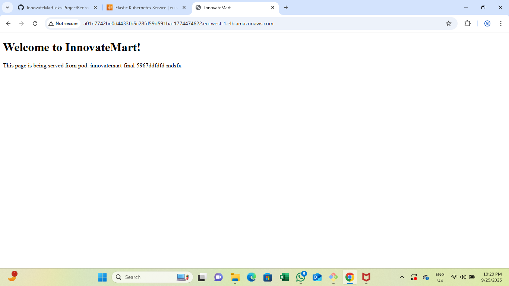

🚀 InnovateMart EKS Project Bedrock

This project demonstrates deploying a simple web application called InnovateMart on an Amazon EKS (Elastic Kubernetes Service) cluster using Kubernetes manifests. It covers everything from infrastructure provisioning to application deployment and debugging.

---

📌 Project Overview

The goal of this assignment was to:

1. Provision a Kubernetes cluster on AWS (EKS).

2. Deploy the InnovateMart application using Kubernetes manifests.

3. Configure Deployments, Services, and Namespaces.

4. Debug issues that arose (such as misconfigured services and HTML content not rendering correctly).

5. Confirm pods, services, and application behavior.

6. Produce a final README documenting the full workflow.

---

🛠️ Steps Taken

1. Infrastructure Setup

Created an EKS cluster on AWS.

Configured local machine with:

kubectl

awscli

eksctl

Verified connectivity with:

kubectl get nodes

---

2. Namespace Creation

I created a dedicated namespace for isolation:

kubectl create namespace innovatemart

---

3. Application Deployment

Deployment Manifest

A Kubernetes Deployment was written to manage the InnovateMart pods:

Container: nginx

Volume for serving static content

Labels: app=innovatemart-final

Applied with:

kubectl apply -f deployment.yaml -n innovatemart

Service Manifest

Initially, the service.yaml caused routing issues because of incorrect configuration.
I fixed it by ensuring:

Correct selector: app=innovatemart-final

Proper port and targetPort

Applied with:

kubectl apply -f service.yaml -n innovatemart

---

4. Verifying Pods

I confirmed pods were running:

kubectl get pods -n innovatemart

Then checked logs and container contents:

kubectl exec -n innovatemart -it <pod-name> -- sh -c "ls /usr/share/nginx/html"

Output:

index.html

---

5. Debugging the Web Page Issue

At first, the web page showed incorrect/default content
After inspection, it was verified the correct index.html was present inside the container:

kubectl exec -n innovatemart -it <pod-name> -- sh -c "cat /usr/share/nginx/html/index.html"

Output:

<!doctype html>
<html>
<head><title>InnovateMart</title></head>
<body>
  <h1>Welcome to InnovateMart!</h1>
  
This page is being served from pod: innovatemart-final-xxxx

</body>
</html>

This confirmed the pod was serving the intended page.

---

6. Service Verification

I confirmed the Service was routing traffic properly:

kubectl get svc -n innovatemart

The LoadBalancer external IP/DNS was tested in a browser, and the InnovateMart welcome page displayed correctly.

---

✅ Final State

All pods were Running.

The InnovateMart web page rendered correctly.

Services and routing were verified.

Issues with service.yaml were corrected without disrupting pods.

---

📂 Repository Structure

kubernetes-manifests/
│── deployment.yaml
│── service.yaml
│── namespace.yaml
│── README.md  ← (this file)

---

📘 Lessons Learned

1. Always match selectors in Services with labels in Deployments.

2. Use kubectl exec to debug container contents.

3. Changing service.yaml carelessly can cause service disruptions.

4. Debugging is best done step by step (pods → logs → exec → services).

---

🏁 Conclusion

This project successfully demonstrated how to:

Provision and configure an EKS cluster.

Deploy an application using Kubernetes manifests.

Debug issues in real-time.

Serve a static HTML application reliably from Kubernetes pods.
